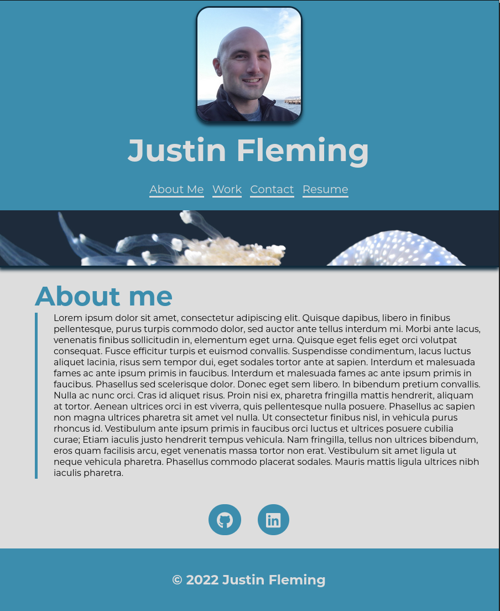

# react-portfolio

## Description

The goal of this project was to create my portfolio using react.js and then deploy it on Github Pages.

## Table of Contents (Optional)

- [Usage](#usage)
- [Credits](#credits)
- [License](#license)

## Usage

### Live Demo

[DEMO](https://gnimelf.github.io/react-portfolio/)

## Credits

React.js

## License

 

## Badges

  
